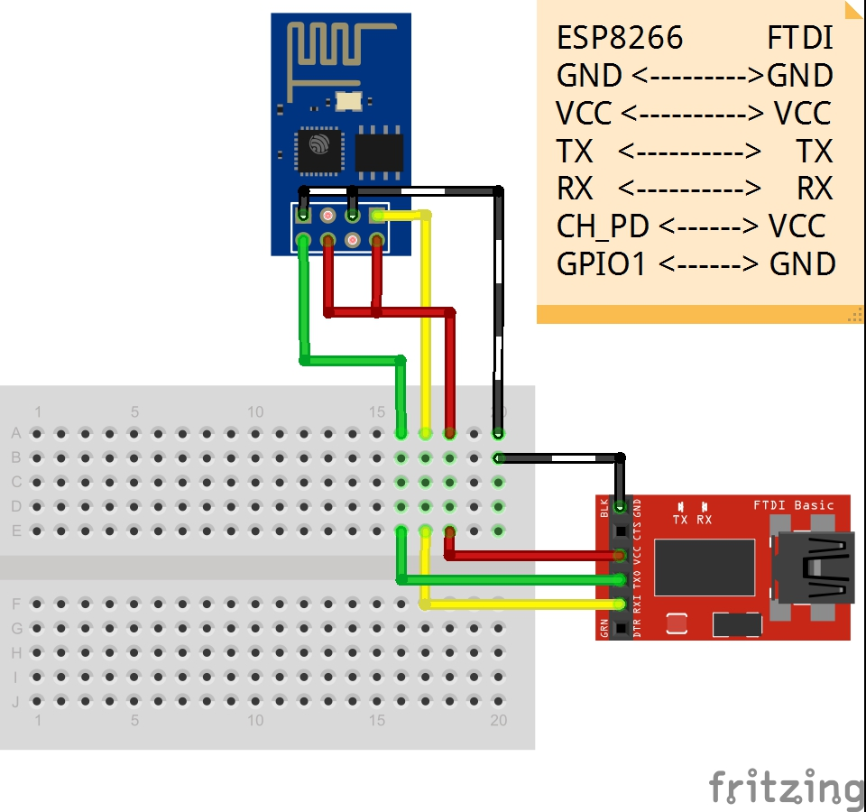
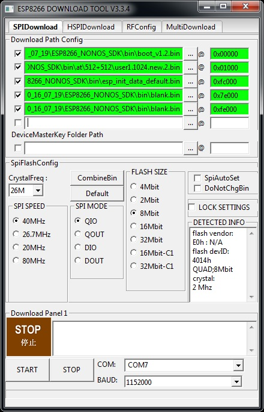

# ESP8266 Firmware Update

When I started working with the ESP8266 found a lot of examples, libraries and AT commands references, but they all were really different from one to another (if you use a library that was not designed with your current version of AT commands you are gonna have a hard time), so I decided to make this library with an specific firmware version and part from there, this folder contains all the necessary files to make your ESP8266 work with this library.

This library use the following versions:

 - AT version:1.3.0.0(Jul 14 2016 18:54:01)
 - SDK version:2.0.0(656edbf)

NOTE: The firmware used on this library is provided by Espressif, if you want the latest version of their firmware you should visit their [site](http://bbs.espressif.com/viewtopic.php?t=25).

## Check your current firmware version

You can check your current version of AT commands by executing the commands "AT+GMR", if you have exactly this version you don't need to update the firmware.

```
AT+GMR
AT version:1.3.0.0(Jul 14 2016 18:54:01)
SDK version:2.0.0(656edbf)
compile time:Jul 19 2016 18:44:44
OK
```

## Instructions to update the ESP8266 firmware

 - Connect your ESP8266 as follow:

 

 - Unzip ESP8266_NONOS_SDK_V2.0.0_16_07_19.zip 
 - Unzip flash_download_tools_v3.3.4_win.zip
 - Execute ESPFlashDownloadTool_v3.3.4.exe
 - Setup the tool as described: 

 

 - Select your COM port
 - Select Baud rate (default is 115200) 
 - Press START, this should proceed successfully if you have connected your ESP8266 correctly
 - Check the firmware version

## Not working?

If you are not able to update your firmware using this tool please post a comment and maybe we can help you!


